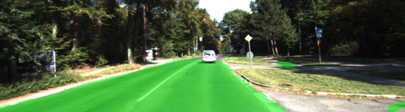
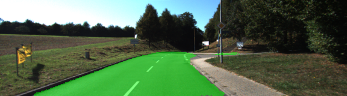
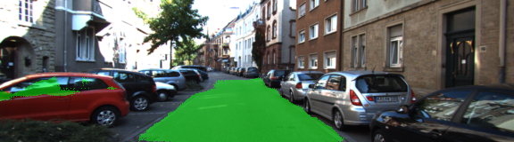

# Semantic Segmentation

## Introduction

This project trains a semantic segmentation network to identify road regions in the image. Semantic segmentation is a technique which labels every pixel in the image as belonging to a category, like road, sky, tree, etc. In this project, a semantic segmentation network is trained using Fully Convolutional Network (FCN) to identify road pixels. This is a crucial part of the perception pipeline of an autonomous vehicle used to determine drivable path in front of the vehicle. This can be used to plan a path in the vicinity of the vehicle.

## Build and Train the Network

The following steps were used to build a network for semantic segmentation using a Fully Convolutional Network based off the paper [Fully Convolutional Networks for Semantic Segmentation](https://arxiv.org/pdf/1605.06211.pdf).

1. Load a pre-trained VGG16 network. See the `load_vgg` function in `main.py` for the details.
2. Adjust the network to an encoder-decoder style architecture using 1x1 convolution, transposed convolution and skip connections. The `layers` function accomplishes this.
  * 1x1 convolutions are added to adjust the depth to correspond to the number of classes (2 in this case).
  * transposed convolutions are added to progressively upsample activations back to the size of the original image.
  * skip connections are added from shallow encoder layers to deeper decoder layers to improve spatial resolution.

3. Build the training pipeline. An Adam optimizer is used with a cross-entropy loss. Regularization is added to the loss to avoid overfitting. The `optimize` and `train_nn` functions accomplish this.
4. Train the network after settling a reasonable hyperparameter set. 25 epochs were trained using a batch size of 4. See the `run` function for more details.
5. Evaluate the network on the test set.

## Results

Overall results are quite good, with the network able to reliably detect road pixels. There are areas of the road that are not correctly labeled as road pixels. This could be improved using more training data or using data augmentation.

## Getting Started

The information below is from the original `README` provided by Udacity containing instructions for getting started.

### Setup

#### GPU

`main.py` will check to make sure you are using GPU - if you don't have a GPU on your system, you can use AWS or another cloud computing platform.

#### Frameworks and Packages

Make sure you have the following is installed:

- [Python 3](https://www.python.org/)
- [TensorFlow](https://www.tensorflow.org/)
- [NumPy](http://www.numpy.org/)
- [SciPy](https://www.scipy.org/)

You may also need [Python Image Library (PIL)](https://pillow.readthedocs.io/) for SciPy's `imresize` function.

#### Dataset

Download the [Kitti Road dataset](http://www.cvlibs.net/datasets/kitti/eval_road.php) from [here](http://www.cvlibs.net/download.php?file=data_road.zip).  Extract the dataset in the `data` folder.  This will create the folder `data_road` with all the training a test images.
